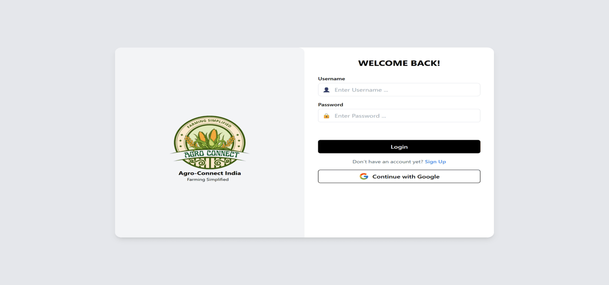
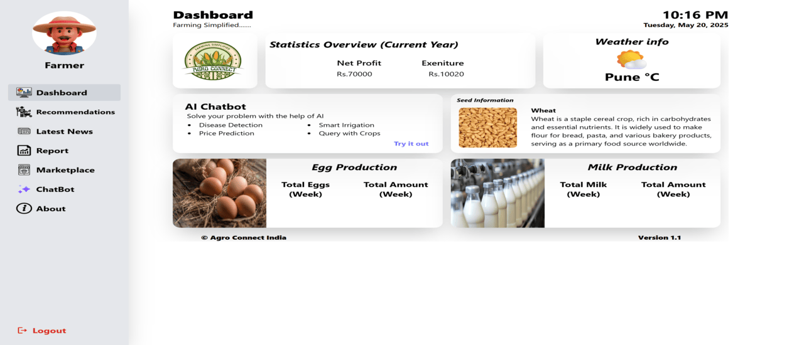
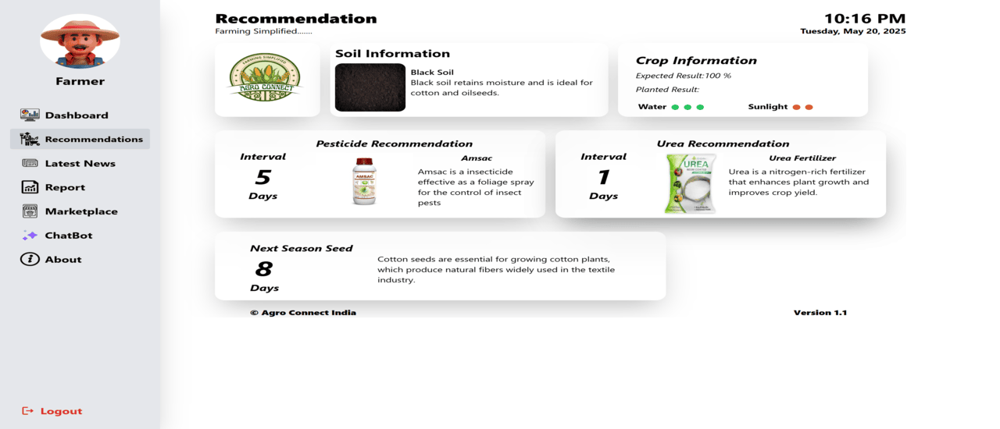
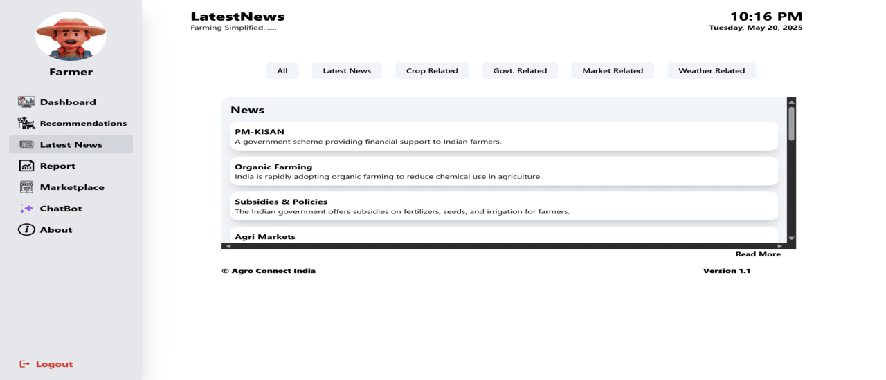
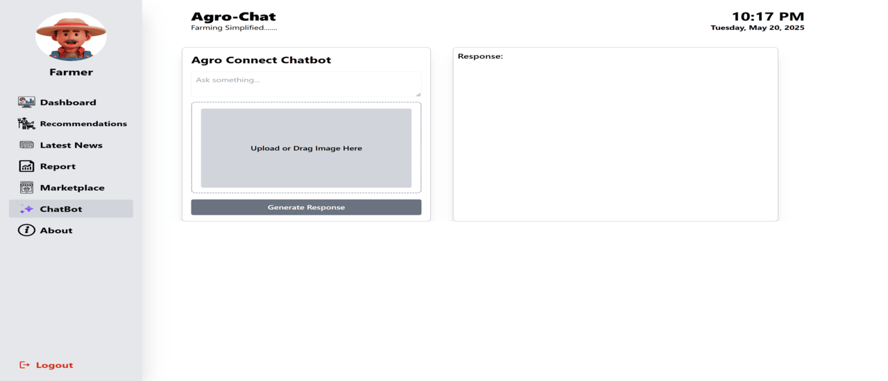
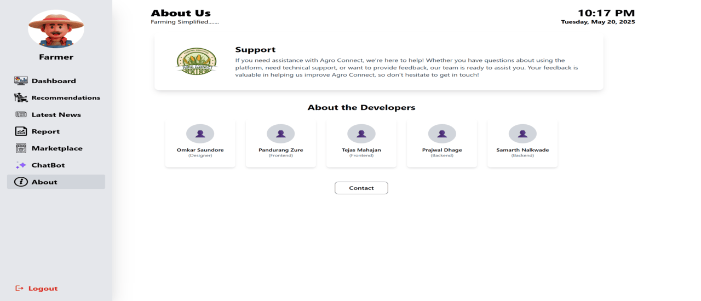

## 🌱 AgroConnect – Tech Meets Agriculture

AgroConnect is a smart agriculture dashboard designed to simplify farm management. It helps track daily records like egg production, milk output, weather data, seed info, and financial stats—all in one clean interface. The idea was to build a system that empowers farmers and agriculture-based businesses using the power of technology.

AgroConnect was developed as my final year capstone project for my Diploma in Computer Engineering, aimed at solving real-world problems in the agricultural sector using technology.

## ⚙️ Tools & Technologies Used
Frontend: React.js + Vite

Backend: Python Flask

Styling: Tailwind CSS

Hosting: GitHub Pages (for frontend)

APIs: Weather API for real-time updates

## ❌ Mistakes I Made
Forgot to set the correct base path in vite.config.js, which caused assets to break on GitHub Pages.

Reloading routes gave 404 errors because I didn’t add a 404.html fallback for SPA routing.

Initially used GITHUB_TOKEN for deployment, which didn’t have push access to gh-pages.

## 📚 What I Learned
How to deploy React apps to GitHub Pages correctly.

Importance of base paths in Vite when working with subfolder hosting.

GitHub Actions automation with peaceiris/actions-gh-pages.

Debugging broken deployments with browser dev tools and console logs.

AgroConnect was more than just a project—it was a learning journey that bridged agriculture with tech. It taught me deployment best practices, how to debug like a pro, and reinforced the power of simple tools solving real-world problems.

## 📸 Some Images of My AgroConnect Project
Here are a few screenshots showcasing the AgroConnect dashboard, including features like real-time weather info, production stats, and farm record panels—all designed for a seamless and user-friendly experience.

- ### Login Screen

- ### Dashboard

- ### Recommendations

- ### Latest News

- ### ChatBot

- ### About
