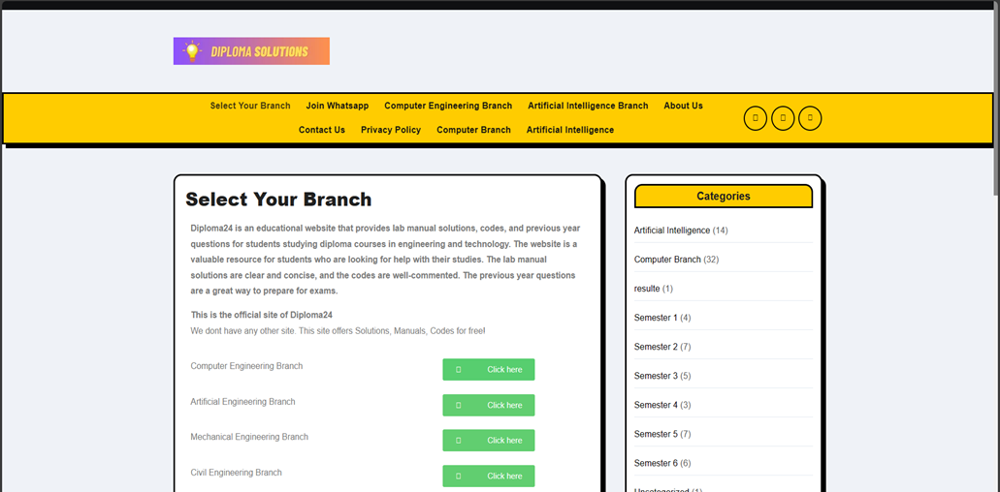
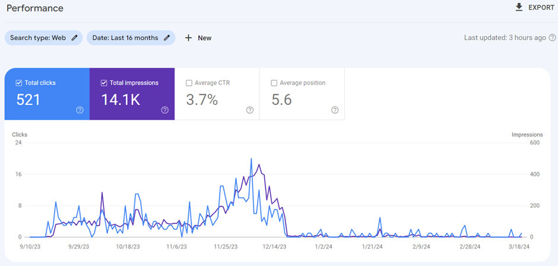

Diploma Solutions was my first step into the world of building real-world web platforms that solve problems. Built entirely on WordPress, this blog-style website was designed to help diploma students access study material and academic content effortlessly.

The goal was simple: reduce the friction students face while searching for reliable resources. I hosted all the necessary academic PDFs on Google Drive, ensuring lightweight and fast delivery. The site’s structure and categories were optimized for quick navigation, giving users a seamless experience even on mobile devices.

Despite being a basic setup, Diploma Solutions gained traction through word-of-mouth and organic searches. I implemented basic analytics tools to track traffic and behavior, and was proud to see its reach grow over time — a strong motivation booster for future web projects.

To maintain performance and load times, I used caching plugins and a clean, minimal theme which kept things simple and distraction-free.

## Key Highlights:
🧰 Built on WordPress (no custom code)

📂 PDFs hosted on Google Drive

📊 Integrated basic Google Analytics

⚡ Optimized for speed and mobile usability

🌱 Reached hundreds of students with minimal promotion

The project was hosted at http://diploma24.online, serving students actively for a period of time. However, as of now, the site is no longer maintained and has been taken offline.
This project was created during my first year of diploma in Computer Engineering as a hobby project. It was a learning experience that allowed me to explore the basics of web development and WordPress, as well as the importance of efficient content delivery.

While the site is no longer maintained and currently offline, it remains a milestone in my journey as a tech enthusiast, showcasing my ability to identify a need and create a solution at an early stage in my career.

Here’s a glimpse of the website and its traffic insights during its peak:

- ### Home Screen

- ### Site Performance
